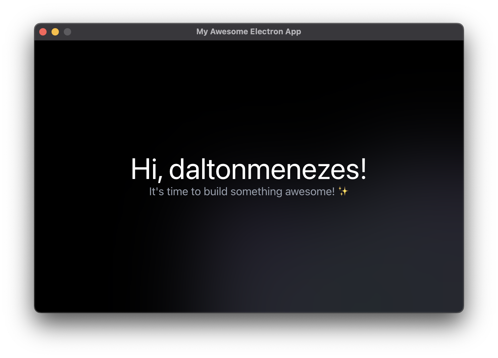

<h1 align="center"> Electron App</h1>

<p align="center">💅 A <strong>ready-to-go</strong> with a <strong>well-thought-out structure</strong> Electron app boilerplate with ReactJS, TypeScript, CSS / SASS modules, SWC, Eslint, Prettier, <strong>GitHub Action releases</strong> and more.
  <br/><br/>
  <!-- Patreon -->
  <a href="https://www.patreon.com/daltonmenezes">
    
  </a>
  <!-- Version -->
  <a href="https://github.com/daltonmenezes/electron-app/releases">
    
  </a>  
  <!-- License -->
  <a href="https://github.com/daltonmenezes/electron-app/blob/main/LICENSE">
    
  </a>
</p>

<p align="center">
  <a href="#electron-app">
    
  </a>
</p>

#  Features
- **Stands out**
  - 🔥 Ready-to-go with a well-thought-out structure
  - 🚀 Auto reload for main and Hot for renderer process
  - 🎉 Window and Screen routing included
  - 😎 Bridge already configured
  - 🙀 IPC communication included
  - 🔮 GitHub Action releases with `Windows`, `Mac` and `Linux` binaries
  - 🍪 Absolute paths supported
- **Technologies**:
  - 🔋 Electron
  - 🔥 ReactJS
  - 🌎 React Router DOM
  - 🧐 React Developer Tools
  - 💙 TypeScript
  - 📦 Webpack
  - ⚡️ SWC as compiler
  - ✨ CSS / SASS modules
  - 💫 Eslint / Prettier / EditorConfig / Husky / lint-staged / Commitlint
  - 📦 Electron Builder
  - 🔮 action-electron-builder

#  Usage

First, install the dependencies by running on the terminal:

```
yarn
```

That done, just run the project with the following command:

```
yarn dev
```

Now, look at the **app.config.js** file in the root directory, you should update some of that settings with your project branding, also you may notice some of that settings comes from the **package.json**, update it too as you need.

#  Distribution

### For all platforms

> [Check Electron Builder docs](https://www.electron.build/cli)

```
yarn dist
```

### For a specific one

```bash
yarn dist --mac
# OR
yarn dist --win
# OR
yarn dist --linux
```

The compiled apps will be available on the `dist` folder.

#  Releasing
> 🔥 Note: To be able to perform `auto-updates` you will need a `code signed app`, for this purpose you will need to configure it by yourself, so check the [electron-builder](https://www.electron.build/code-signing) and [action-electron-builder](https://github.com/samuelmeuli/action-electron-builder#code-signing) docs please to get know how to do this.

To release your app on a GitHub release with `Windows`, `Mac` and `Linux` binaries, you can perform the following commands:

```bash
git pull
yarn make:release
```

Then, enter the new version of your app, so it will produce the following binaries in a draft release from the action:
  - `Windows` &#8594; `zip (portable)`, `.exe`
  - `Mac` &#8594; `.zip (app)`, `.dmg`
  - `Linux` &#8594; `AppImage`, `freebsd`, `pacman`, `rpm`, `deb`

In this process, the action will be triggered and the previous command will open the `releases` and `actions` page in your browser. When the action is finished, you can click in the `releases` page and refresh it to see the draft release with the binaries, so you can edit it and release it for your users.

https://user-images.githubusercontent.com/1149845/156939675-5ea0c510-ddd3-4de7-b293-87d3697bd1a8.mp4

#  Documents
<table >
  <tr>
    <td valign="bottom">
      <p align="center">
        <a href="./docs/CREATING_WINDOWS.md">
          
        </a>
        <br/><br/>
        <a href="./docs/CREATING_WINDOWS.md">Creating Windows</a>
      </p>
    </td>
    <td valign="bottom">
      <p align="center">
        <a href="./docs/ROUTING.md">
          
        </a>
        <br/><br/>
        <a href="./docs/ROUTING.md">Routing</a>
      </p>
    </td>
    <td valign="bottom">
      <p align="center">
        <a href="./docs/STRUCTURE.md">
          
        </a>
        <br/><br/>
        <a href="./docs/STRUCTURE.md">Structure Overview</a>
      </p>
    </td>
    <td valign="bottom">
      <p align="center">
        <a href="./docs/FAQ.md">
          
        </a>
        <br/><br/>
        <a href="./docs/FAQ.md">FAQ - Frequently Asked Questions</a>
      </p>
    </td>
  </tr>
</table>

# Contributing
> Contributions are always welcome, but always **ask first**, — please — before work on a PR.

That said, there's a bunch of ways you can contribute to this project, like by:

- :beetle: Reporting a bug
- :page_facing_up: Improving this documentation
- :rotating_light: Sharing this project and recommending it to your friends
- :dollar: Supporting this project on Patreon
- :star2: Giving a star on this repository

# License

[MIT © Dalton Menezes](https://github.com/daltonmenezes/electron-app/blob/main/LICENSE)
